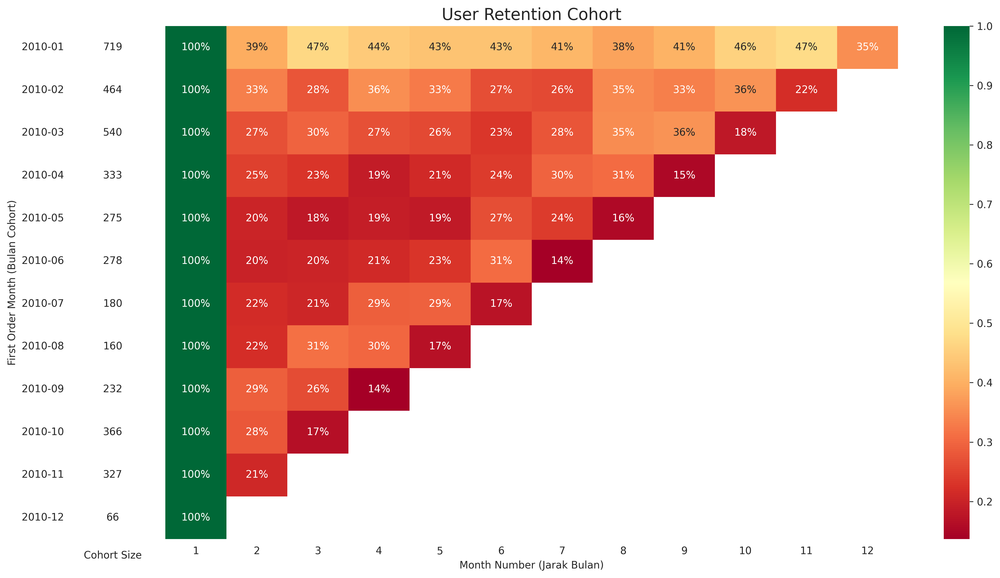

# 📊 User Retention & Cohort Analysis

## 📖 Latar Belakang Proyek
Mempertahankan pelanggan lama (*user retention*) seringkali lebih menguntungkan dan memakan biaya lebih rendah dibandingkan mengakuisisi pelanggan baru secara terus-menerus. Proyek ini bertujuan untuk mengevaluasi seberapa efektif bisnis dalam mempertahankan pelanggannya dari waktu ke waktu melalui metode **Cohort Analysis**. 

Dengan memantau perilaku pengguna berdasarkan bulan pertama mereka bertransaksi (Cohort), kita dapat mengidentifikasi pola pembelian ulang, mendeteksi titik kritis *churn* (pelanggan berhenti), dan memberikan rekomendasi strategis bagi tim bisnis dan pemasaran.

## 🛠️ Tech Stack & Tools
- **Bahasa Pemrograman:** Python
- **Library:** Pandas (Data Manipulation), Seaborn & Matplotlib (Data Visualization)
- **Lingkungan Pengembangan:** Jupyter Notebook / Google Colab

## ⚙️ Alur Kerja (Workflow)
1. **Data Cleansing:** Menghapus data *missing values* pada `customer_id`, membuang duplikat, dan mengonversi format `order_date` menjadi tipe data *datetime*.
2. **Data Aggregation:** Mengelompokkan transaksi setiap pengguna per bulan (`year_month`).
3. **Cohort Definition:** Menentukan bulan pertama transaksi untuk setiap pengguna unik.
4. **Period Calculation:** Menghitung jarak (dalam bulan) antara setiap transaksi lanjutan dengan bulan transaksi pertama.
5. **Pivot & Visualization:** Membangun matriks retensi dan memvisualisasikannya ke dalam bentuk *Heatmap* untuk mempermudah identifikasi tren.

## 📈 Visualisasi Hasil

*(Catatan: Simpan gambar heatmap di dalam folder `assets/` dengan nama file `heatmap_retention.png` di repositori ini)*

## 💡 Analisis User Retention (Business Insights)
Berdasarkan *heatmap* yang dihasilkan, dapat ditarik kesimpulan bisnis sebagai berikut:

1. **Cohort Januari 2010 adalah jawaranya:** Kelompok pengguna pertama ini memiliki ukuran terbesar (719 pengguna) dan paling loyal, dengan tingkat retensi yang stabil di kisaran 35% hingga 47% selama 11 bulan ke depan.
2. **Volume Transaksi Tertinggi:** Cohort *user* yang paling banyak bertransaksi berada pada bulan Januari 2010 sebanyak 613 pengguna.
3. **Loyalitas Jangka Panjang:** Cohort Januari tersebut juga menjadi *cohort* yang paling loyal dibandingkan dengan yang lain karena paling sering bertransaksi pada bulan-bulan berikutnya secara konsisten.
4. **Performa Bulan Kedua Terbaik:** Cohort Januari juga menjadi *user* yang paling sering bertransaksi kembali pada bulan kedua (dapat dilihat dari hasil persentase bulan kedua yaitu sebesar 38%) apabila dibandingkan dengan cohort yang lain.
5. **Krisis Retensi Bulan Kedua (Secara Umum):** Hampir semua *cohort* (selain Januari) mengalami *churn* (kehilangan pelanggan) yang drastis pada bulan kedua setelah transaksi pertama. Misalnya, *cohort* Februari 2010 langsung anjlok ke 33%, dan *cohort* Maret 2010 turun ke 27%. 
6. **Retensi Mayoritas di Bawah 50%:** Sangat disayangkan banyak *user* yang tidak bertransaksi kembali, terlihat dari *retention rate* secara keseluruhan yang dominan berada di bawah 50%.
7. **Penurunan Akuisisi Akhir Tahun:** Cohort Desember 2010 sangat kecil (hanya 66 pengguna). Ini adalah anomali yang perlu disorot untuk evaluasi tim *marketing* di akhir tahun.
8. **Anomali Transaksi Desember:** Pada bulan Desember, yang seharusnya menjadi momentum banyak pengguna untuk bertransaksi kembali (musim liburan/akhir tahun), justru menjadi bulan yang memiliki persentase transaksi berulang paling rendah dari pengguna lama.

## 🚀 Rekomendasi Strategis (Actionable Plan)
Dari *insight* di atas, berikut adalah rekomendasi yang dapat diterapkan oleh perusahaan:
- **Intervensi Bulan Kedua:** Mengingat krisis *churn* selalu terjadi di bulan kedua, perusahaan sangat butuh strategi *onboarding* yang lebih baik atau memberikan "Promo Intervensi / Diskon Win-Back" khusus di minggu ke-3 atau ke-4 setelah pembelian pertama.
- **Revitalisasi Kampanye Akhir Tahun:** Tim *marketing* harus segera mengevaluasi strategi kuartal 4. Promo akhir tahun (Desember) perlu dirancang secara khusus untuk menargetkan *user* lama agar mau kembali berbelanja, guna menutupi rendahnya akuisisi pengguna baru di bulan tersebut.
- **Pelajari Kesuksesan Januari 2010:** Perusahaan perlu menganalisis lebih dalam *campaign* atau produk apa yang ditawarkan pada Januari 2010, dan mereplikasinya, karena terbukti menghasilkan basis pelanggan dengan ukuran dan loyalitas terbaik.
